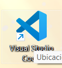
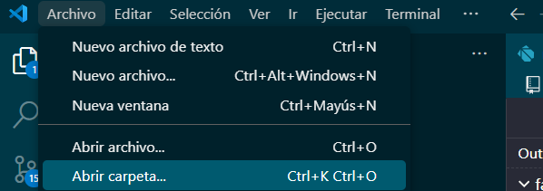
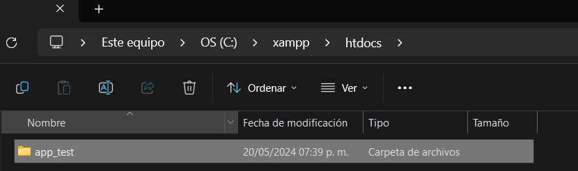
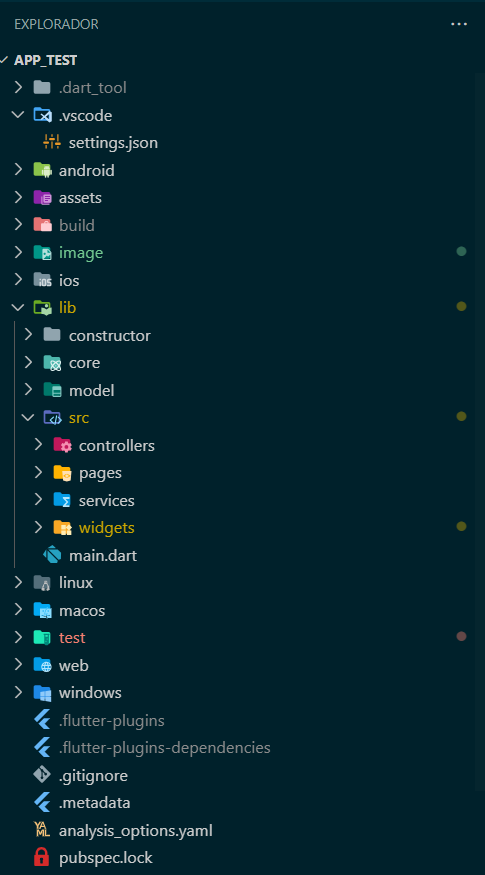
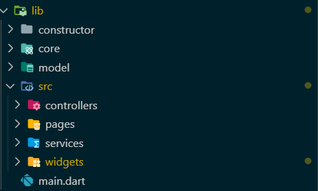
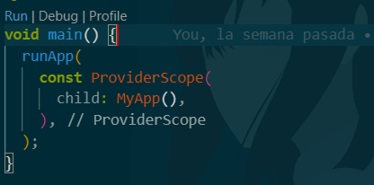
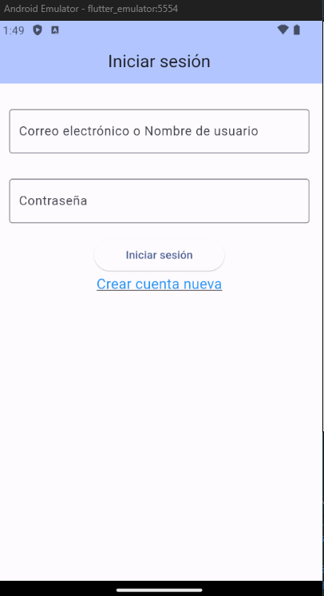
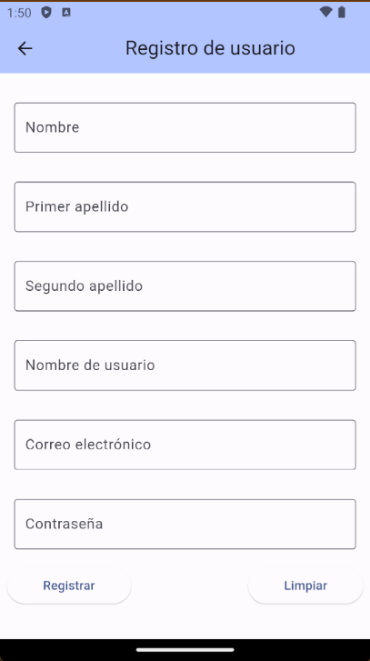
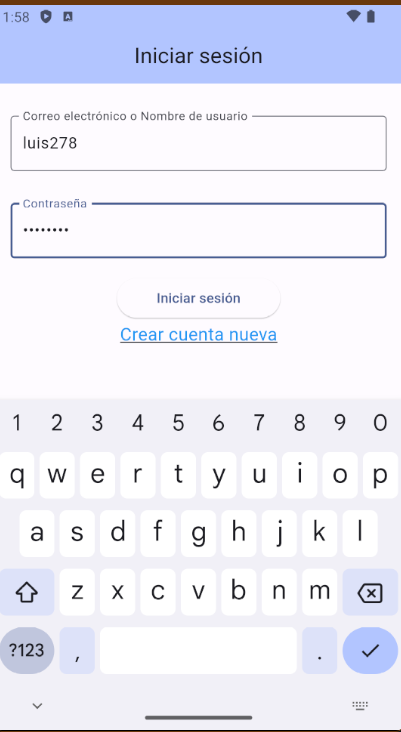
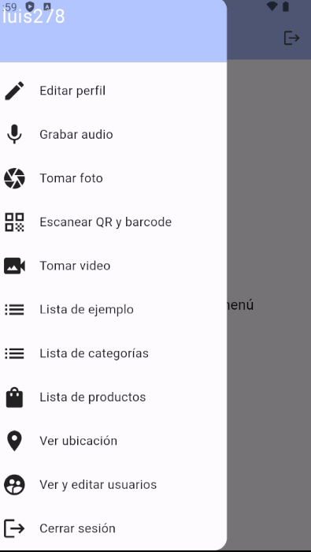

# App_test

Aplicación que permite crear catalogos y registrar productos sin embargo esta aplicación sigue en desarrollo y en busca de mejoras para la misma

## Descarga e instalación.

Ejecutar los siguientes comandos

Paso 1: Clonar el repositorio

```nginx
git clone https://github.com/LuisFer27/app_test.git

```

Paso 2 :Abrir visual studio code



Paso 3 seleccionar la carpeta en donde se guardo el repositorio en la opción  archivo y abrir carpeta



se selecciona la carpeta en donde esta ubicado el repositorio ya que en este caso esta almacenado en documentos pero puede variar según el lugar en de lo tengas descargado



Paso 4  una vez abierta la carpeta nos apareceran todas estas carpetas sin embargo la que nos interesa es la de lib en donde se alamcena todo los archivos dart para la ejecución de la aplicación



Paso 5 abriremos la carpeta lib y nos dirigiremos al archivo main .dart



abrimos el archivo main.dart y se nos visualizara de esta forma ya que aquí al ser la primera aplicación que se trabajo en fluter se simplifco todo para que solo funcionara a partir de aqui ya que en routes especificamente en la carpeta templates se encuentra l archivo donde esta la función

```dart
import 'package:app_test/core/route.dart';

void main() {
  runApp(Style());
}

}
```

en este caso en el editor le daremos click en run

depende del dispositivo que dispongamos este se ejecutar si no podemos cambiarlo abajo de nuestro editor 

y escoger nuestro dispositivo principalmente movil ya que en este caso podemos seleccionar movil o virtual como en este ejemplo


## Funcionalidad.



Inicio de sesión: permite iniciar a partir cuenta de correo o nombre de usuario incluyendo contraseña

crear:nueva cuenta permite crear una nueva cuenta para entrar al sistema



Formulario: permite agregar un nombre completo con apellidos, nombre de usuario ,contraseña y correo electrónico

botón registrar: agrega los datos en una base de datos mediante sqlite ya que es para pruebas se adaptara a firebase

limpiar:limpia los datos del formulario



Rellenado de datos permite rellenar los campos mediante los datos prporcionados

Opciones del menú



Editar perfil:permite modificar los datos del usuario

Grabar Audio: permite grabar audio mediante el uso del microfono del celular

Tomar foto:permite tomar fotos usuando la camara

Escanear qr y barcode permite escanear codigos de barra y registrar el producto

Tomar video permite captiurar video usando la camara del celular solo que de forma con limte de 5 segundos

Listas de ejemplos,categorias y de productos :Catalogos para la visualización

Ver ubicación:permite ver la ubicación del dispositivo

Ver y editar usuarios esta funcion de momento no esta disponible pero sirve para ver la información de los usuarios que se han registrado

Cerrar sesión vuele a la pantalla de inicio
